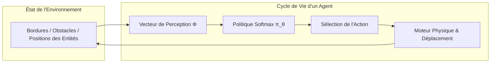

[🇬🇧 Read in English](README.md)

# EcoSim-RL — Système Multi-Agents avec Apprentissage par Renforcement

<div align="center">

[](https://fr.wikipedia.org/wiki/C99)
[](https://www.libsdl.org/)
[](https://fr.wikipedia.org/wiki/Pthreads)
[](Makefile)
[](doc/html/index.html)
[](LICENSE)

**Simulation interactive 2D d'un écosystème multi-agents où prédateurs et protecteur développent des comportements émergents via l'algorithme REINFORCE (Policy Gradient), avec rendu temps réel sous SDL2 et accélération d'entraînement par multi-threading POSIX.**

[Présentation](#-présentation) • [Fonctionnalités Clés](#-fonctionnalités-clés) • [Dynamique Multi-Agents](#-dynamique-multi-agents) • [Modèle RL & Parallélisation](#-modèle-de-renforcement--parallélisation) • [Architecture](#-architecture-du-projet) • [Démarrage Rapide](#-démarrage-rapide--commandes) • [Équipe & Rôles](#-équipe--contributions-dingénierie)

<p align="center">
  
</p>

</div>

---

## 🌟 Présentation

Développé dans le cadre du projet d'ingénierie de fin de première année à l'**ISIMA** (Clermont Auvergne INP), **EcoSim-RL** modélise un écosystème prédateurs-proies dynamique. Contrairement aux approches classiques basées sur des machines à états déterministes codées en dur, les agents de cet environnement prennent leurs décisions à partir d'une **politique stochastique paramétrée** entraînée par **Apprentissage par Renforcement**.

L'écosystème met en scène trois types d'entités :
- **Les Chèvres (Proies)** : Agents réactifs qui broutent, se déplacent en troupeau et fuient instinctivement à l'approche d'un prédateur.
- **Les Loups (Prédateurs)** : Agents apprenants entraînés à traquer et encercler les chèvres tout en évitant le rayon d'interception du fermier.
- **Le Fermier (Protecteur)** : Entité hybride pilotable soit **manuellement** par l'utilisateur au clavier, soit en **mode autonome** via une politique neuronale entraînée pour éliminer les prédateurs et préserver le troupeau.

---

## 🚀 Fonctionnalités Clés

- **Système Multi-Agents (SMA)** : Entités autonomes décentralisées évoluant sur une carte 2D bornée avec gestion d'obstacles physiques (obstacle du lac, bordures de monde, hitboxes dédiées).
- **Apprentissage Policy Gradient (REINFORCE)** : Entraînement en ligne et par lots des vecteurs de poids de politique via une distribution Softmax et mise en forme des récompenses (*reward shaping*).
- **Moteur d'Entraînement Parallélisé** : Pipeline d'entraînement haute performance sans affichage graphique exploitant les **threads POSIX (`pthreads`)** pour simuler simultanément plusieurs épisodes indépendants.
- **Double Mode de Jeu & Hot-Swap** : Bascule instantanée en temps réel entre le contrôle manuel (ZQSD / WASD / Flèches) et le pilotage IA autonome d'une simple touche (`M`).
- **Moteur Graphique SDL2 Temps Réel** : Pipeline visuel fluide à 60 FPS avec animations par feuilles de sprites, typographie pixel art personnalisée et bandeau HUD dynamique.
- **Rigueur et Robustesse C** : Nettoyage mémoire rigoureux validé avec les sanitizers GCC (`-fsanitize=address,undefined`) et documentation complète au format **Doxygen**.

---

## 🎮 Dynamique Multi-Agents

Chaque entité de la simulation exécute à chaque pas de temps une boucle formelle **Perception $\rightarrow$ Décision $\rightarrow$ Action** :



| Entité | Rôle | Modèle Comportemental | Objectif Principal |
| :--- | :--- | :--- | :--- |
| **Fermier** 👨‍🌾 | Protecteur | Clavier manuel OU Politique RL Apprise | Protéger les chèvres, intercepter les loups, patrouiller |
| **Loups** 🐺 | Prédateurs | Politique RL Apprise (Gradient Softmax) | Chasser les chèvres, contourner et fuir le fermier |
| **Chèvres** 🐐 | Proies | Boids / Flocking Réactif vectoriel | Brouter pacifiquement, fuir dans le rayon de vision des loups |

---

## 🧠 Modèle de Renforcement & Parallélisation

### 1. Espace d'États et Politique Linéaire
À chaque étape, chaque agent apprenant extrait un vecteur de caractéristiques normalisées $\Phi(s)$ comprenant :
- Les distances euclidiennes et orientations relatives vers la cible la plus proche (proie / menace).
- La proximité aux bordures de la carte et aux obstacles physiques (lac).
- L'état interne de l'agent (points de vie, temps de recharge d'action).

Le choix de l'action $a \in \mathcal{A}$ est échantillonné selon une **distribution de Softmax (Gibbs)** :

$$\pi_\theta(a \mid s) = \frac{\exp(\theta^T \phi(s, a))}{\sum_{a' \in \mathcal{A}} \exp(\theta^T \phi(s, a'))}$$

### 2. Optimisation par Gradient de Politique (REINFORCE)
Au fil de chaque épisode, la trajectoire des transitions $(s_t, a_t, r_{t+1})$ est mise en mémoire. À la fin de l'épisode, les paramètres $\theta$ sont mis à jour par montée de gradient sur le gain espéré :

$$\theta \leftarrow \theta + \alpha \sum_{t=0}^{T-1} \nabla_\theta \log \pi_\theta(a_t \mid s_t) \, G_t$$

avec le retour actualisé $G_t = \sum_{k=t}^{T-1} \gamma^{k-t} r_{k+1}$ ($\gamma = 0.99$, taux d'apprentissage $\alpha = 2 \times 10^{-5}$).

### 3. Entraînement Parallèle Multi-Threadé
Afin de lever le goulet d'étranglement de l'affichage graphique et accélérer la convergence des poids :
- Un mode sans rendu graphique (`./farmer train -m`) gère un pool de workers exécutés en parallèle via `pthreads` (`taille_groupe = 8`).
- Chaque thread simule un épisode complet de 1 000 pas sur un clone isolé du monde.
- Le thread maître agrège les gradients et met à jour les fichiers de poids (`poids_fermier.txt`, `poids_loup.txt`), permettant un **gain de vitesse d'un facteur ~6** sur processeurs multi-cœurs.

---

## 📁 Architecture du Projet

```text
Jeu-SMA-Reinforce/
├── affichage.c / .h        # Moteur de rendu SDL2, gestion des textures, HUD & polices
├── utilisateur.c / .h      # Écoute des événements clavier et interactions utilisateur
├── maitre_du_jeu.c         # Cœur du programme : boucle principale, threads & entraînement
├── monde.c / .h            # Initialisation du monde, physique globale, cycle de vie
├── monde_fermier.c / .h    # Cinématique du fermier, calcul de perception & récompenses
├── monde_goat.c / .h       # Logique de troupeau des chèvres, broutement & évitement
├── monde_wolf.c / .h       # Traque des loups, perception relative & calcul des récompenses
├── fermier.c / .h          # Structures de données du fermier, inventaire & actions
├── loup.c / .h             # Structures de données des loups, hitboxes & actions
├── goat.c / .h             # Structures de données des chèvres & états vitaux
├── reinforce.c / .h        # Algorithme REINFORCE : mémoires de trajectoires & gradient
├── poids_fermier.txt       # Poids de politique sauvegardés pour le fermier
├── poids_loup.txt          # Poids de politique sauvegardés pour les loups
├── fonts/                  # Polices TrueType PixeloidSans et Arial
├── images/                 # Sprites, interface graphique, tuiles de terrain & GIF démo
├── doc/html/               # Documentation d'API complète générée par Doxygen
├── Doxyfile                # Fichier de configuration Doxygen
├── Makefile                # Script de compilation multi-cibles (all, debug, opt, doc, clean)
├── LICENSE                 # Licence Open-Source MIT
├── README.fr.md            # Documentation en français
└── README.md               # Documentation en anglais
```

---

## ⚡ Démarrage Rapide & Commandes

### Prérequis

- **GCC** (avec support C99 et POSIX Threads)
- **SDL2**, **SDL2_image**, **SDL2_ttf**
- **Doxygen** & **Graphviz** *(optionnel, pour générer la documentation)*

```bash
# Debian / Ubuntu
sudo apt-get update
sudo apt-get install -y gcc make libsdl2-dev libsdl2-image-dev libsdl2-ttf-dev doxygen graphviz

# macOS (via Homebrew)
brew install gcc make sdl2 sdl2_image sdl2_ttf doxygen graphviz
```

### Compilation

```bash
# Compilation standard (avec symboles de débogage)
make

# Mode Débogage avec Sanitizers (AddressSanitizer + UndefinedBehaviorSanitizer)
make debug

# Mode Optimisé pour entraînement intensif (-O3)
make opt

# Génération de la documentation HTML
make doc
```

### Lancement de la Simulation

```bash
# 1. Mode Démonstration Interactive (Contrôle manuel du fermier par défaut)
./farmer

# 2. Mode Démonstration 100% Autonome (Fermier piloté par la politique RL apprise)
./farmer test

# 3. Entraînement Parallèle Multi-Threadé sans interface graphique (Accéléré par pthreads)
./farmer train -m

# 4. Entraînement Simple Cœur sans interface graphique
./farmer train
```

### Contrôles en Jeu

| Touche | Action |
| :---: | :--- |
| `Espace` | **Pause / Reprendre** la simulation |
| `M` | **Changer de Mode** (Bascule instantanée entre contrôle manuel et IA autonome) |
| `Z / Q / S / D` ou `W / A / S / D` | **Déplacer le Fermier** (en mode manuel) |
| `Flèches directionnelles` | **Déplacer le Fermier** (touches alternatives) |
| `Échap` / Fermer la fenêtre | **Quitter** le jeu |

---

## 👥 Équipe & Contributions d'Ingénierie

Projet conçu et réalisé en collaboration par 3 élèves ingénieurs de l'ISIMA :

| Contributeur | Rôles Principaux | Contributions Techniques Majeures |
| :--- | :--- | :--- |
| **Natéo Gadaix**<br>([@lyko27](https://github.com/lyko27)) | **Architecture Système & Parallélisme** | • Coordination de la boucle de jeu et du maître du jeu (`maitre_du_jeu.c`)<br>• Implémentation du multi-threading pour l'entraînement parallèle (`pthreads`)<br>• Gestion du cycle de vie des entités, PV, cooldowns et moteur de collision<br>• Refactorisation modulaire du monde (`monde_goat.c`, `monde_wolf.c`)<br>• Architecture de la documentation Doxygen et validation de la propreté mémoire |
| **Nicolas Bertrand**<br>([@nicolas-btd](https://github.com/nicolas-btd)) | **Cœur de l'Algorithme RL** | • Implémentation mathématique de l'algorithme REINFORCE (`reinforce.c`)<br>• Équilibrage des récompenses et réglage des hyperparamètres ($\alpha, \gamma$)<br>• Sérialisation des poids appris et points de contrôle de convergence<br>• Compatibilité multi-plateforme Linux / macOS pour les threads |
| **Sohail Labied**<br>([@sohail-lbd](https://github.com/sohail-lbd)) | **Moteur Graphique & Entrées** | • Intégration du moteur graphique SDL2 (`affichage.c`)<br>• Gestion des événements utilisateur et entrées clavier (`utilisateur.c`)<br>• Importation de la police pixel art et création du bandeau HUD (`ath.png`)<br>• Modélisation et réglage des hitboxes de collision des entités |

---

## 📜 Genèse du Projet : Du Jeu de la Vie au Système Multi-Agents

Durant la première semaine du projet, l'équipe a d'abord conçu une implémentation intégrale du **Jeu de la Vie de Conway** en C avec SDL2. Cette étape préparatoire a permis d'éprouver les structures de données en grille torique 2D, la synchronisation des états cellulaires et la gestion d'événements interactifs. Ces acquis ont ensuite servi de tremplin pour aborder la conception du système multi-agents continu et autonome présenté dans ce dépôt.

---

## 📄 Licence

Ce projet est distribué sous licence MIT. Consultez le fichier [LICENSE](LICENSE) pour plus d'informations.
