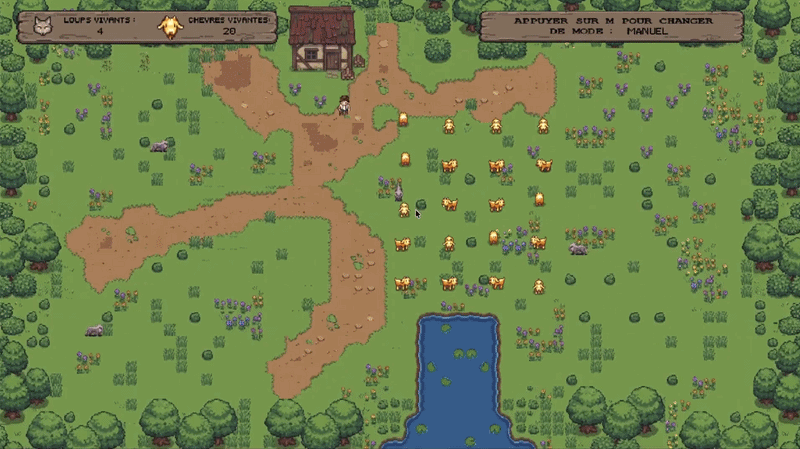
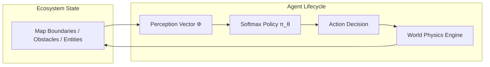

[🇫🇷 Lire en français](README.fr.md)

# EcoSim-RL — Multi-Agent Ecosystem with Reinforcement Learning

<div align="center">

[](https://en.wikipedia.org/wiki/C99)
[](https://www.libsdl.org/)
[](https://en.wikipedia.org/wiki/Pthreads)
[](Makefile)
[](doc/html/index.html)
[](LICENSE)

**An interactive 2D multi-agent simulation where autonomous predators and protectors learn emergent behaviors through Monte-Carlo Policy Gradient (REINFORCE) algorithms, rendered in real time with SDL2 and accelerated via POSIX multi-threading.**

[Overview](#-overview) • [Key Features](#-key-features) • [Multi-Agent Dynamics](#-multi-agent-dynamics) • [RL & Concurrency](#-reinforcement-learning--concurrency) • [Architecture](#-project-architecture) • [Quickstart](#-quickstart--controls) • [Team & Contributions](#-team--engineering-contributions)

<p align="center">
  
</p>

</div>

---

## 🌟 Overview

Developed as an end-of-year engineering project at **ISIMA** (Clermont Auvergne INP), **EcoSim-RL** models an interactive predator-prey ecosystem. Unlike traditional rule-based video game simulations with deterministic state machines, agents in this environment make decisions using a **parameterized stochastic policy** trained with **Reinforcement Learning**.

The simulation features:
- **Goats (Prey)**: Reactive agents that herd, graze, and instinctively evade nearby predators.
- **Wolves (Predators)**: Learning agents trained to track and hunt goats while steering clear of the protective farmer.
- **Farmer (Protector)**: Hybrid agent that can be operated **manually** by the user or set to **autonomous mode** governed by a trained neural policy to safeguard the herd and eliminate wolves.

---

## 🚀 Key Features

- **Multi-Agent System (SMA)**: Decentralized autonomous agents interacting within an obstacle-bounded 2D map (lake obstacle, boundaries, entity hitboxes).
- **Policy Gradient Learning (REINFORCE)**: Online and batch training of agent weight vectors using parameterized softmax policies and reward shaping.
- **Parallel Training Pipeline**: High-throughput headless training module leveraging **POSIX Threads (`pthreads`)** to simulate multiple independent learning episodes concurrently.
- **Dual Gameplay Modes & Hot-Swapping**: Switch seamlessly in real time between user control (ZQSD / WASD / Arrows) and AI policy-driven navigation at the press of a key.
- **Real-Time SDL2 Rendering**: 60 FPS graphical pipeline with animated sprite sheets, custom pixel fonts, and dynamic HUD status overlays.
- **Memory & Safety Hardening**: Compiled and verified with GCC sanitizers (`-fsanitize=address,undefined`) and documented with **Doxygen**.

---

## 🎮 Multi-Agent Dynamics

The ecosystem operates as a discrete-time continuous-space simulation where each agent executes a strict **Perception $\rightarrow$ Decision $\rightarrow$ Action** loop:



| Entity | Role | Behavior Model | Objective |
| :--- | :--- | :--- | :--- |
| **Farmer** 👨‍🌾 | Guardian | Manual Input OR Learned RL Policy | Protect goats, intercept wolves, optimize territory |
| **Wolves** 🐺 | Predator | Learned RL Policy (Softmax gradient) | Hunt goats, coordinate attacks, avoid farmer |
| **Goats** 🐐 | Prey | Reactive Vector Flocking | Graze peacefully, flee within predator vision radius |

---

## 🧠 Reinforcement Learning & Concurrency

### 1. State Perception & Linear Policy
Each agent extracts a low-dimensional normalized perception vector $\Phi(s)$ representing:
- Relative distance and angular orientation to the nearest target (prey / predator).
- Proximity to map borders and environmental obstacles (lake hitbox).
- Internal state variables (action cooldowns, health points).

Actions $a \in \mathcal{A}$ are selected according to a **Softmax (Gibbs) distribution**:

$$\pi_\theta(a \mid s) = \frac{\exp(\theta^T \phi(s, a))}{\sum_{a' \in \mathcal{A}} \exp(\theta^T \phi(s, a'))}$$

### 2. Policy Gradient Optimization (REINFORCE)
During training, agents collect trajectory transitions $(s_t, a_t, r_{t+1})$. Policy parameters $\theta$ are updated at the end of each episode via gradient ascent on the expected return $J(\theta)$:

$$\theta \leftarrow \theta + \alpha \sum_{t=0}^{T-1} \nabla_\theta \log \pi_\theta(a_t \mid s_t) \, G_t$$

where $G_t = \sum_{k=t}^{T-1} \gamma^{k-t} r_{k+1}$ represents the discounted cumulative reward ($\gamma = 0.99$, $\alpha = 2 \times 10^{-5}$).

### 3. Multi-Threaded Parallel Training
To bypass graphical bottlenecks and accelerate weight convergence:
- An optimized headless training routine runs parallel worker threads (`taille_groupe = 8` threads).
- Each thread instantiates its own isolated world clone, runs an independent episode of 1,000 steps, and records trajectories.
- The main thread aggregates gradients and updates policy weights (`poids_fermier.txt`, `poids_loup.txt`), achieving a **~6x training speedup** on multi-core systems.

---

## 📁 Project Architecture

```text
Jeu-SMA-Reinforce/
├── affichage.c / .h        # SDL2 rendering engine, sprites, HUD & font rendering
├── utilisateur.c / .h      # User keyboard/event processing (manual controls & UI)
├── maitre_du_jeu.c         # Main orchestrator: game loop, thread pool & RL training
├── monde.c / .h            # World initialization, global physics, entity lists & lifecycles
├── monde_fermier.c / .h    # Farmer kinematics, perception computation & reward logic
├── monde_goat.c / .h       # Goat flocking mechanics, grazing routines & evasive maneuvers
├── monde_wolf.c / .h       # Wolf tracking physics, perception computation & reward shaping
├── fermier.c / .h          # Farmer data structures, inventory & policy actions
├── loup.c / .h             # Wolf data structures, hitboxes & policy actions
├── goat.c / .h             # Goat data structures & entity states
├── reinforce.c / .h        # REINFORCE algorithm: trajectory buffers, softmax & gradient ascent
├── poids_fermier.txt       # Serialized learned policy weights for the Farmer
├── poids_loup.txt          # Serialized learned policy weights for the Wolves
├── fonts/                  # PixeloidSans and Arial TrueType fonts
├── images/                 # Spritesheets, UI assets, map tiles & demo GIF
├── doc/html/               # Doxygen-generated API documentation
├── Doxyfile                # Doxygen configuration file
├── Makefile                # Multi-target build script (all, debug, opt, doc, clean)
├── LICENSE                 # MIT License
├── README.fr.md            # Documentation in French
└── README.md               # Documentation in English
```

---

## ⚡ Quickstart & Controls

### Prerequisites

- **GCC** (with C99 & POSIX support)
- **SDL2**, **SDL2_image**, **SDL2_ttf**
- **Doxygen** & **Graphviz** *(optional, for docs)*

```bash
# Debian / Ubuntu
sudo apt-get update
sudo apt-get install -y gcc make libsdl2-dev libsdl2-image-dev libsdl2-ttf-dev doxygen graphviz

# macOS (Homebrew)
brew install gcc make sdl2 sdl2_image sdl2_ttf doxygen graphviz
```

### Compilation

```bash
# Standard build (Debug symbols included)
make

# Debug build with AddressSanitizer and UndefinedBehaviorSanitizer
make debug

# Optimized build for heavy RL training (-O3)
make opt

# Generate HTML documentation
make doc
```

### Running the Simulation

```bash
# 1. Interactive Demonstration (Manual Farmer control by default)
./farmer

# 2. Fully Autonomous Simulation (Farmer guided by trained RL policy)
./farmer test

# 3. Parallel Multi-Threaded Headless Training (Accelerated via pthreads)
./farmer train -m

# 4. Single-Threaded Headless Training
./farmer train
```

### In-Game Controls

| Key | Action |
| :---: | :--- |
| `Space` | **Pause / Resume** simulation |
| `M` | **Toggle Mode** (Switch dynamically between Manual and Autonomous RL) |
| `Z / Q / S / D` or `W / A / S / D` | **Move Farmer** (in manual mode) |
| `Arrow Keys` | **Move Farmer** (alternate manual keys) |
| `Escape` / Window Close | **Quit** game |

---

## 👥 Team & Engineering Contributions

This project was developed collaboratively by a team of 3 engineering students:

| Contributor | Focus Areas | Key Engineering Contributions |
| :--- | :--- | :--- |
| **Natéo Gadaix**<br>([@lyko27](https://github.com/lyko27)) | **Game Architecture & Concurrency** | • Orchestrated game lifecycle and state manager (`maitre_du_jeu.c`)<br>• Implemented multi-threaded parallel training with `pthreads`<br>• Designed entity combat physics, HP systems & boundary collision engine<br>• Modular refactoring of world subsystems (`monde_goat.c`, `monde_wolf.c`)<br>• Doxygen documentation architecture & memory leak audit |
| **Nicolas Bertrand**<br>([@nicolas-btd](https://github.com/nicolas-btd)) | **RL Algorithm Core** | • Implemented Monte-Carlo Policy Gradient mathematics (`reinforce.c`)<br>• Engineered reward functions and tuned hyperparameters ($\alpha, \gamma$)<br>• Formulated weight vector serialization & convergence checkpoints<br>• Added cross-platform Apple/macOS thread compatibility |
| **Sohail Labied**<br>([@sohail-lbd](https://github.com/sohail-lbd)) | **Graphics & UI Engine** | • Engineered SDL2 rendering pipeline (`affichage.c`)<br>• Implemented event handling and keyboard navigation (`utilisateur.c`)<br>• Integrated custom pixel font and dynamic HUD stats banner (`ath.png`)<br>• Designed entity hitbox collision detection models |

---

## 📜 Project Genesis & Cellular Automata

During the first week of this project, the team built a complete **Conway's Game of Life** in C using SDL2 to establish foundational patterns in 2D grid processing, toroidal wrapping, and graphical event-driven architectures. This foundational work provided the building blocks needed to transition toward the complex, continuous-space multi-agent ecosystem presented here.

---

## 📄 License

This project is licensed under the MIT License — see the [LICENSE](LICENSE) file for details.
